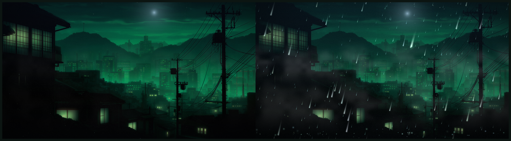

# Wallpaper Weather

Live weather for your Omarchy wallpaper — any wallpaper. Rain, sunshine and
night are **independent toggles that stack**, with thunder on top of rain.

It measures the picture you have set to work out where the sky is, so the moon
lands in open sky rather than inside a building, and it remembers that per
wallpaper.



Everything is real-time QML drawn straight onto the background layer. No video,
no animated GIF, no second wallpaper daemon. With all three toggles off it is a
still photograph with a very slow drift, and costs essentially nothing.

## Install

```bash
omarchy plugin add https://github.com/RR-CodeBase/omarchy-wallpaper-weather.git --enable
cd ~/.config/omarchy/plugins/io.github.rr-codebase.wallpaper-weather
./install.sh
```

The first command is the plugin. The second is the desktop wiring that a plugin
install cannot do for itself, because it lives in files that belong to you:

* `wallpaper-weather` on your PATH, and bash completion for it
* the **bar widget**, placed in the right-hand section
* the **Osaka Jade Weather theme** (see below)

`install.sh` is idempotent, skips anything already present, and only ever edits
a file inside a marked block it created. `--dry-run` shows exactly what it would
touch; `--uninstall` reverses precisely that.

| Flag | Effect |
|---|---|
| `--no-widget` | do not add the bar widget |
| `--no-theme` | do not build the Osaka Jade Weather theme |
| `--with-theme-hook` | park the weather when you switch away from its theme |
| `--dry-run` | print the plan, change nothing |

> **This replaces Omarchy's background renderer** while it is enabled. That is
> unavoidable rather than rude — the day/night grade is applied to the
> photograph itself, so the plugin has to own the layer the photo is drawn on.
> See [How it takes over the wallpaper](#how-it-takes-over-the-wallpaper).

The Omarchy menu rows are the one thing `install.sh` will not add for you —
they share a file with your own entries. See [Omarchy menu](#omarchy-menu).

### Updating

```bash
omarchy plugin update io.github.rr-codebase.wallpaper-weather
```

Your state survives an update — moods, dials and sky placement are kept.

(`plugin add` is for first installs only; it refuses an id that is already
present and points you at `plugin update`.)

## Uninstall

Run these **in order**. `install.sh` lives inside the plugin, so removing the
plugin first would take the uninstaller with it:

```bash
cd ~/.config/omarchy/plugins/io.github.rr-codebase.wallpaper-weather
./install.sh --uninstall                   # PATH link, completions, widget, theme, menu, hook
omarchy plugin enable omarchy.background   # hand the wallpaper back to Omarchy
cd ~ && omarchy plugin remove io.github.rr-codebase.wallpaper-weather
```

`--uninstall` removes the menu rows too, provided you pasted them with their
marker comments. It deletes the marked line range rather than rewriting the
file, so your own entries and comments survive, and it restores a backup if the
result would not parse. Rows pasted without markers are reported, not guessed
at.

**State is kept.** `~/.local/state/omarchy/wallpaper-weather.json` survives, so a
reinstall picks up where you left off. Delete it for a clean slate.

`omarchy plugin remove` deletes the plugin directory, including its git checkout
if you cloned it. Nothing is lost that is not on GitHub, and reinstalling with
`omarchy plugin add` gives you a fresh clone with `origin` already set.

### Installing by hand

Omarchy loads any valid plugin directory, so you can clone it yourself if you
would rather read the code first:

```bash
git clone https://github.com/RR-CodeBase/omarchy-wallpaper-weather.git \
  ~/.config/omarchy/plugins/io.github.rr-codebase.wallpaper-weather
omarchy plugin enable io.github.rr-codebase.wallpaper-weather
```

The directory name **must** match the `id` in `manifest.json` — that is where
`omarchy plugin update` and `omarchy plugin remove` look, and they will not find
the plugin otherwise. `omarchy plugin add` names it that way for you.

## The three toggles

| | |
|---|---|
| 󰖗 `rain` | two rain curtains at different depths, thickened mist, ground splashes, a wet desaturated grade |
| 󰖙 `day` | warm grade, sun disc, seven swaying god rays, drifting dust motes |
| 󰖔 `night` | cool grade, moon, ninety twinkling stars, fireflies over the rooftops |
| 󱐋 `thunder` | distant lightning behind the towers. A modifier on rain, not a mood — rain alone is just rain |

Combinations are real states, not collisions. The colour grade **averages** the
active moods rather than summing them, so `rain + day` lands on "overcast
afternoon" instead of blowing out:

```
rain + night  → Night Storm      day + night  → Golden Hour
rain + day    → Sun Shower       all three    → Everything At Once
```

## Control

```bash
wallpaper-weather                 # what's on
wallpaper-weather rain            # toggle
wallpaper-weather thunder on      # lightning, on top of rain
wallpaper-weather storm           # preset
wallpaper-weather cycle           # step through the good combinations
wallpaper-weather --help
```

### Automatic modes

Two settings that keep tracking rather than firing once:

```bash
wallpaper-weather follow-sun on       # day/night follows local sunrise and sunset
wallpaper-weather follow-weather on   # mirror the weather outside (wttr.in)
```

They check every five minutes and compose: `follow-sun` owns day and night,
`follow-weather` owns rain, thunder, wind and intensity. **Toggling a mood by
hand releases whichever mode owns it**, so a manual change is never silently
undone on the next tick.

One-shot equivalents remain if you want the result without the tracking:
`wallpaper-weather auto` and `wallpaper-weather sync`.

## The theme

`install.sh` builds a theme called **Osaka Jade Weather** and leaves it for you
to apply:

```bash
omarchy theme set "Wallpaper Weather"
```

It is Omarchy's own *Osaka Jade* theme with the backgrounds trimmed to
**Glowing City** alone. That trimming is the entire point: the sky placement
defaults are composed for that photograph, so a theme that cannot cycle to a
different one can never leave the moon sitting inside a building. Same colours,
same everything else.

It is generated at install time from the copy already on your machine rather
than shipped in this repo — no redistributing several megabytes of someone
else's wallpapers, and no drift when Omarchy updates them.

`--uninstall` removes it, but only if you have not touched it: the installer
records a checksum of what it generated, and keeps the theme if anything
differs. If it is the active theme at the time, you are switched back to stock
Osaka Jade first so the desktop always has something to render.

Prefer the full set of backgrounds? Use stock `osaka-jade` with `--no-theme`,
and retune with `wallpaper-weather sky` when you change wallpaper.

## Bar widget

One icon in the bar, and a panel behind it built the way Omarchy's own audio and
network panels are:

* a **switch per mood** — rain, sunshine, night, and thunder on top of rain.
  They are independent and stack, so switches rather than a radio group
* **intensity** and **wind** sliders
* **Automatic** — switches for the two tracking modes, follow the sun and match
  real weather
* **Presets** — buttons for whole combinations: clear, rain, storm, golden
  hour, night

The bar icon shows what is on at a glance; click it for the panel, middle-click
to clear. Every value lives in the panel, so nothing changes by scrolling past
the bar.

`install.sh` places it in the right-hand section by default:

```bash
./install.sh --no-widget                      # skip it
WALLPAPER_WEATHER_SECTION=center ./install.sh     # or put it elsewhere
```

To move or remove it later, edit `bar.layout` in `~/.config/omarchy/shell.json`;
it hot-reloads on save. The panel can also be summoned without the bar:

```bash
omarchy-shell io.github.rr-codebase.wallpaper-weather toggle
```

## Omarchy menu

`extras/omarchy-menu.jsonc` holds a ready-made **Osaka Jade Weather** submenu —
the three toggles with live tick marks, the presets, and the two automatic
modes. Paste its contents into your own
`~/.config/omarchy/extensions/omarchy-menu.jsonc`, inside the top-level object;
the file hot-reloads on save.

**Keep the two marker comments.** `install.sh --uninstall` uses them to take
exactly these rows back out later without disturbing anything else in that
file.

The ids are namespaced (`wallpaper-weather.*`) so they never collide with Omarchy's
own weather forecast rows, and each toggle's `checked` condition reads the live
state file rather than caching, so the ticks are always accurate.

## Colours

Two kinds, deliberately treated differently.

The **sky tints and the sun and moon are physical**: sunlight is warm and
moonlight is cold on anyone's wallpaper, so those stay fixed. Theming them would
mean rendering a sunrise the wrong colour to match a terminal palette.

The **accent life follows your theme**: fireflies take `Color.accent`, and rain
takes an ambient tint off `Color.foreground`, because rain is water and picks up
whatever light is around it. Switch themes and the weather follows.

## Fitting it to your wallpaper

This happens by itself. When the wallpaper changes, the plugin looks at the new
one, finds the horizon and the most open patch of sky, and puts the sun, moon,
stars and mist bands where they belong. The result is filed against that
wallpaper, so switching back and forth costs nothing and any hand-tuning sticks.

```bash
wallpaper-weather sky               # what it settled on
wallpaper-weather sky auto          # measure this wallpaper again
wallpaper-weather sky recall        # re-apply this wallpaper's saved placement
wallpaper-weather sky forget        # drop it and re-measure next time
```

How it decides: the horizon is the sharpest sustained fall in row brightness
top-down, since sky is nearly always brighter than what is under it; `skyLeft`
is where the sky band stops being dark, so stars are not drawn inside a
building; and the disc goes in the brightest patch, biased upward because the
brightest sky is usually the glow just above the skyline, which is exactly where
a moon should not sit. On the wallpaper the defaults were hand-tuned for, it
measures a horizon of 0.333 against the 0.34 chosen by eye.

Everything is overridable, and every value is a fraction of the screen:

```bash
wallpaper-weather sky                      # show current placement
wallpaper-weather sky moon 0.60 0.11 0.52  # x, y, diameter
wallpaper-weather sky sun  0.60 0.14 0.95
wallpaper-weather sky horizon 0.34         # where the sky ends; stars stop here
wallpaper-weather sky skyLeft 0.16         # stars fade in past foreground objects
wallpaper-weather sky groundLevel 0.42     # top of the near foreground
wallpaper-weather sky reset
```

Other dials: `intensity` (0.2–2.0, particle density), `wind` (−1–1, rain slant),
and the booleans `drift` (slow ken-burns push), `parallax` (photo leans away
from the pointer), `grain` (film grain) and `enabled` (master switch).

## How it takes over the wallpaper

This plugin declares `clonedFrom: omarchy.background`, which tells Omarchy to
disable its own background plugin and use this one instead while this is
enabled. The day/night colour grade is applied to the photograph itself, so an
overlay-only version could draw rain but could never turn night into morning.

Reverting is one command, and your wallpaper choice is untouched:

```bash
omarchy plugin enable omarchy.background
```

## How it fits together

```
~/.local/state/omarchy/wallpaper-weather.json   state, the single source of truth
bin/wallpaper-weather                        the only writer
WeatherState.qml                         watches that file; one instance
WeatherFx.qml                            the visuals; one per monitor
Background.qml                           photo transform + colour grade
WeatherWidget.qml                        optional bar widget
assets/generate.py                       regenerates every sprite
```

`wallpaper-weather` writes the state file atomically and then pokes
`omarchy-shell -q wallpaper-weather reload`. The IPC only skips the file watcher's
latency — hand-editing the JSON, or driving it over SSH, works just as well.

Sprites are generated, not downloaded: `python3 assets/generate.py` rebuilds
every one from stdlib Python. They are white with a meaningful alpha channel and
get tinted in QML, so one small atlas serves rain, sun, moon, stars and
fireflies.

## Notes for the curious

* A **NaN animation target segfaults Quickshell** inside the scene graph with no
  QML warning at all. If you fork this and the shell starts crash-looping, look
  for an animation whose `to:` evaluates to `undefined`.
* `ImageParticle` stretches its texture to a **square** quad — which is why
  `raindrop.png` is a thin streak drawn inside a 128×128 canvas rather than a
  128×10 image.
* Stopping a `ParticleSystem` **freezes its last frame** rather than clearing it,
  so each system keeps running for one particle lifetime after its mood is
  switched off, and fades out underneath.

## Requirements

Omarchy 4.x (Quattro) with its Quickshell-based shell, plus `jq`. `curl` is only
needed for `wallpaper-weather sync`. Qt's `QtQuick.Particles`, `QtQuick.Effects` and
`QtQuick.Shapes` modules ship with `qt6-declarative`.

## Licence

MIT — see [LICENSE](LICENSE).

`Background.qml` is a derivative of Omarchy's own `omarchy.background` plugin,
also MIT. [NOTICE](NOTICE) records exactly which parts come from Omarchy and
which were added here.
